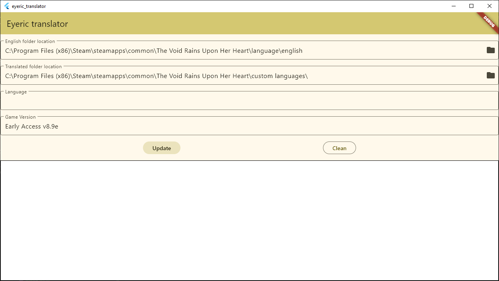

# eyeric_translator

This repo is a tool for updating your translated folder for the hit video game [The Void Rains Upon Her Heart](https://store.steampowered.com/app/790060/The_Void_Rains_Upon_Her_Heart/).

## Features

This Flutter app saves the folders path for the english folder as well as the translated one, plus the language you're using, so you don't have to reinput them for each single update.
This app does NOT overwrite your translated folder. Instead, it creates a new one with the suffix "_new".

## How to use

Click the folder icon in order to get the path for the english/translated folder.
The last two text fields are for the version file.
Click the Update button to update your folder! The white box will fill with logs showcasing progress. Once "All done!" appears, the process is finished.
The Clean button is for removing all logs.

## Disclaimers

To check if the folders are valid, it only checks if the version file exists. Please make sure to only use localization folders for this game, as I cannot garantee what would happen with anything else (at worst it should only duplicate a folder). I do not take responsability for any missuse of this software.